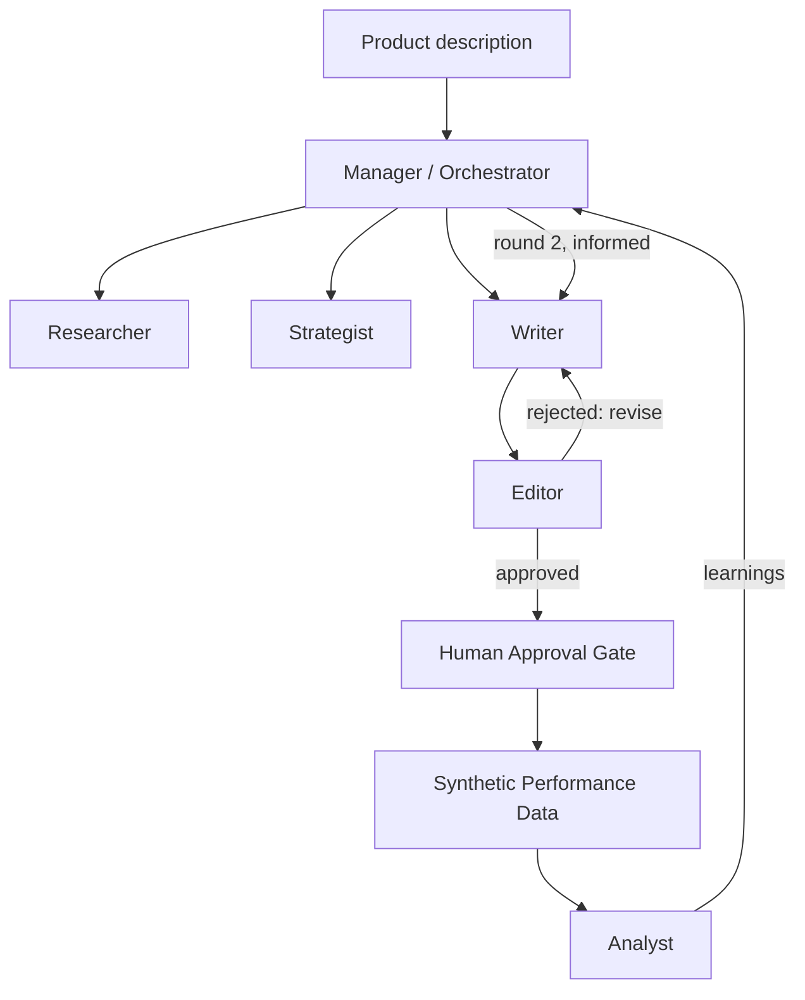

# AdLoop — A Multi-Agent Marketing Workflow

A working multi-agent system where specialised AI agents — **Researcher, Strategist, Writer, Editor, and Analyst** — collaborate under a **Manager/Orchestrator** to plan, produce, review, and iteratively improve a marketing campaign, with a human-approval checkpoint before anything is treated as "published."

Give it one product description. It hands back a fully reviewed, two-round campaign — and shows its work at every step.

> Runs against **Vertex AI (Gemini)** or the **Anthropic API (Claude)**, or in **MOCK_MODE** with zero keys and zero cost — so anyone can clone this and watch the full architecture run end to end before spending a cent.

---

## Why this exists

Most "AI marketing" demos are one prompt that writes an ad. The hard part isn't the first draft: it's the revision loop — keeping content on-brief across channels, catching output that drifts, deciding when a draft is good enough, and knowing afterwards which version was approved and why.

AdLoop models that loop explicitly: a multi-step, self-correcting workflow with retries, structured-output validation, a human-in-the-loop safety gate, and a feedback loop where round two is briefed from round one's results — not just "call the LLM twice."

---

## Architecture



- **Manager** — decides what happens next; the actual agentic core of the system.
- **Researcher** — produces a market/competitor summary for the product.
- **Strategist** — turns that into a structured campaign brief (audience, funnel stage, key message, primary KPI). That brief is the shared context every downstream agent is grounded in.
- **Writer** — drafts content for three channels: social post, email, ad copy.
- **Editor** — reviews each draft against the brief; rejects and sends it back for revision (capped retry limit) rather than rubber-stamping everything.
- **Human Approval Gate** — nothing is treated as "live" without explicit sign-off.
- **Analyst** — reads (synthetic, clearly-labelled) performance data and extracts concrete recommendations.
- **Feedback loop** — round two's brief is explicitly informed by the Analyst's findings, and the charts show whether it actually helped. Sometimes it doesn't; the point is that the comparison is visible rather than assumed.

---

## Features

- ✅ Full multi-agent orchestration with a genuine revision loop and feedback loop
- ✅ Two interchangeable LLM backends: **Vertex AI (Gemini)** and **Anthropic (Claude)**, behind one `complete()` interface
- ✅ Retry logic with exponential backoff on every LLM call
- ✅ Defensive structured-output parsing (`safe_json_extract`) with tested fallback behaviour, not silent failure
- ✅ Human-in-the-loop approval gate before anything counts as "published"
- ✅ Full audit trail of every agent decision, exportable to CSV
- ✅ `MOCK_MODE` — the entire pipeline runs with zero API keys and zero cost
- ✅ Three charts: round-over-round CTR/conversion, ROAS vs. breakeven, and revision-loop efficiency

---

## Getting Started

```bash
git clone https://github.com/Abhishek10-r/AdLoop.git
cd AdLoop
pip install -r requirements.txt
python main.py                      # MOCK_MODE — no keys, no cost
python main.py "A cold-brew coffee subscription for office workers"
```

### Running against a real model

**Gemini API (quickest)** — a free key from [Google AI Studio](https://aistudio.google.com/apikey), no Google Cloud setup:

```bash
export GEMINI_API_KEY="..."
python main.py
```

**Vertex AI (Gemini on Google Cloud)** — authenticates with application default credentials, so there is no key to paste:

```bash
gcloud auth application-default login
export GOOGLE_CLOUD_PROJECT=your-project-id
export LLM_PROVIDER=vertex          # optional; vertex is preferred automatically
python main.py
```

**Anthropic (Claude):**

```bash
export ANTHROPIC_API_KEY="sk-ant-..."
export LLM_PROVIDER=anthropic
python main.py
```

With none configured, the pipeline says so and runs in `MOCK_MODE`.

### Tracing with LangSmith

Every agent call is wrapped as a LangSmith run, named after the agent (Researcher, Strategist, Writer, Editor, Analyst), so a full campaign shows up as a trace you can inspect prompt by prompt:

```bash
export LANGSMITH_TRACING=true
export LANGSMITH_API_KEY="..."      # free account at smith.langchain.com
export LANGSMITH_PROJECT=adloop
python main.py
```

Tracing is off unless you turn it on, and without the `langsmith` package installed the wrapper is a no-op.

### Notebook

`notebooks/demo.ipynb` runs the same pipeline step by step, and works in Google Colab (add credentials via the 🔑 **Secrets** panel, or leave them out for `MOCK_MODE`).

### Tests

```bash
python -m pytest -q
```

---

## Evaluating the judge

The Editor is an **LLM-as-a-judge**: it scores each draft against the brief and returns a structured pass/fail verdict. A judge is only useful if it agrees with a person, so `evaluate_judge.py` measures that.

```bash
python evaluate_judge.py generate   # writes eval/to_label.csv (48 drafts)
# label the human_label column yourself: pass / fail for THIS brief
python evaluate_judge.py score      # runs the Editor and compares it to you
```

`generate` pairs half the drafts with the brief they were written for and half with a different brief, so there are genuinely off-brief drafts to catch. Which is which lives in `eval/answer_key.csv`, not in the file you label, so it can't bias your labels.

`score` reports agreement, precision / recall / F1 for **fail** (the rare, costly case the judge exists to catch) and **Cohen's kappa**, which corrects for chance agreement — a judge that approves everything can still score high raw agreement, but its kappa is zero. Both steps need a live backend; mock mode is refused because the mock Editor answers at random.

---

## Tech Stack

| Layer | Choice |
|---|---|
| LLM | Gemini (`gemini-2.5-flash`, via Vertex AI or the Gemini API) or Anthropic (`claude-sonnet-5`) |
| Tracing | LangSmith (optional) |
| Language | Python 3.10+ |
| Data validation | `dataclasses` + a defensive JSON-extraction utility |
| Visualisation | `matplotlib`, `pandas` |
| Notebook environment | Google Colab / Jupyter |

Adding a third backend means writing one class with a `complete(system_prompt, user_message, max_tokens)` method in `src/config.py`; the agents never touch the provider SDK directly.

---

## Repo Structure

```
AdLoop/
├── README.md
├── main.py                  # run a full two-round campaign end to end
├── evaluate_judge.py        # measure the Editor (LLM-as-a-judge) against human labels
├── requirements.txt
├── .env.example
├── src/
│   ├── config.py            # backend selection: Vertex / Anthropic / MOCK_MODE
│   ├── schemas.py
│   ├── utils.py             # safe_json_extract
│   ├── evaluation.py        # agreement, precision/recall, Cohen's kappa
│   ├── agents/
│   │   ├── base.py          # shared retry + mock logic
│   │   ├── researcher.py
│   │   ├── strategist.py
│   │   ├── writer.py
│   │   ├── editor.py
│   │   └── analyst.py
│   ├── orchestrator.py
│   ├── performance.py       # synthetic performance data generator
│   └── visualizations.py
├── notebooks/
│   └── demo.ipynb
└── tests/
    └── test_agents.py
```

---

## Sample Output

Running the default demo (`"A plant-based protein bar aimed at gym-goers"`) produces:

- A market research summary and structured campaign brief
- Reviewed, on-brand content across 3 channels, for 2 full rounds
- A complete decision-by-decision audit trail (`agent_audit_trail.csv`)
- A one-row pipeline metrics summary (`pipeline_metrics.csv`)
- 3 comparison charts (CTR/conversion, ROAS, revision-loop counts)

---

## A note on the performance data

The performance figures are **synthetic**, generated in `src/performance.py` — this project has no live ad account attached. That makes the feedback loop's *mechanism* real and its *numbers* illustrative. Replacing the generator with the Google Ads or Meta Marketing API is the first item on the roadmap.

---

## Roadmap / Potential Upgrades

- [ ] Real performance data via the Google Ads or Meta Marketing API, replacing the synthetic generator
- [ ] Real web search for the Researcher agent (Tavily / SerpAPI) instead of relying on the model's own knowledge
- [ ] Fully dynamic orchestration — let the Manager itself be an LLM decision at each step, not a mostly-fixed sequence
- [ ] A Streamlit UI for the human-approval step
- [ ] A dedicated guardrails/compliance check, separate from brand-voice editing
- [ ] Persistent memory (vector DB) so the Strategist can retrieve what worked on similar past campaigns
- [ ] Statistical significance testing on round-over-round performance, not just a visual comparison

---

## Licence

MIT — free to use, adapt, and build on.
