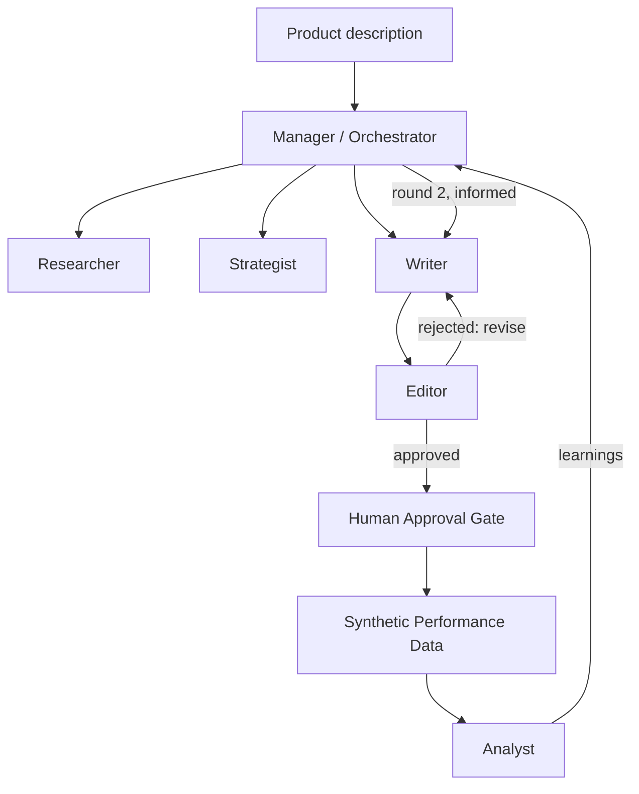

# AI Marketing Team — A Multi-Agent Marketing Workflow

A working multi-agent system where specialized AI agents — **Researcher, Strategist, Writer, Editor, and Analyst** — collaborate under a **Manager/Orchestrator** to plan, produce, review, and iteratively improve a marketing campaign, with a human-approval checkpoint before anything is treated as "published."

Give it one product description. It hands back a fully reviewed, two-round campaign — and shows its work at every step.

> Runs in two modes: with a live `ANTHROPIC_API_KEY` (real Claude-powered agents) or in **MOCK_MODE** with zero keys and zero cost, so anyone can clone this and see the full architecture run end to end before spending a cent.

---

## Why this exists

Most "AI marketing" demos are one prompt that writes an ad. This project is built to demonstrate the actual skill a role like *Agentic Marketing Specialist* requires: designing a **multi-step, self-correcting workflow** — with retries, structured-output validation, a revision loop, a human-in-the-loop safety gate, and a genuine feedback loop where round two is measurably informed by round one's results — not just "call the LLM twice."

---

## Architecture



- **Manager** — decides what happens next; the actual agentic core of the system.
- **Researcher** — produces a market/competitor summary for the product.
- **Strategist** — turns that into a structured campaign brief (audience, funnel stage, key message, primary KPI).
- **Writer** — drafts content for three channels: social post, email, ad copy.
- **Editor** — reviews each draft against the brief; rejects and sends back for revision (capped retry limit) rather than rubber-stamping everything.
- **Human Approval Gate** — nothing is treated as "live" without explicit sign-off.
- **Analyst** — reads (synthetic, clearly-labeled) performance data and extracts concrete recommendations.
- **Feedback loop** — round two's brief is explicitly informed by the Analyst's findings, and the notebook charts whether it actually helped.

---

## Features

- ✅ Full multi-agent orchestration with a genuine revision loop and feedback loop
- ✅ Retry logic with exponential backoff on every LLM call
- ✅ Defensive structured-output parsing (`safe_json_extract`) with tested fallback behavior, not silent failure
- ✅ Human-in-the-loop approval gate before anything counts as "published"
- ✅ Full audit trail of every agent decision, exportable to CSV
- ✅ `MOCK_MODE` — the entire pipeline runs with zero API keys and zero cost
- ✅ Three professional charts: round-over-round CTR/conversion, ROAS vs. breakeven, and revision-loop efficiency

---

## Getting Started

### Option A — Google Colab (fastest)
1. Upload `ai_marketing_team_agent_workflow.ipynb` to [Google Colab](https://colab.research.google.com).
2. *(Optional, for real LLM calls)* Add your key via the 🔑 **Secrets** panel as `ANTHROPIC_API_KEY`.
3. Runtime → Run all. Without a key, it runs fully in `MOCK_MODE` automatically.

### Option B — Local / Jupyter
```bash
git clone https://github.com/<your-username>/ai-marketing-team.git
cd ai-marketing-team
pip install -r requirements.txt
export ANTHROPIC_API_KEY="sk-ant-..."   # optional — omit to run in MOCK_MODE
jupyter notebook ai_marketing_team_agent_workflow.ipynb
```

---

## Tech Stack

| Layer | Choice |
|---|---|
| LLM | Claude (Anthropic API) |
| Language | Python 3.10+ |
| Data validation | `dataclasses` + a defensive JSON-extraction utility |
| Visualization | `matplotlib`, `pandas` |
| Notebook environment | Google Colab / Jupyter |

---

## Recommended Repo Structure

```
ai-marketing-team/
├── README.md
├── requirements.txt
├── .env.example
├── src/
│   ├── config.py
│   ├── schemas.py
│   ├── agents/
│   │   ├── base.py
│   │   ├── researcher.py
│   │   ├── strategist.py
│   │   ├── writer.py
│   │   ├── editor.py
│   │   └── analyst.py
│   ├── orchestrator.py
│   ├── performance.py
│   └── visualizations.py
├── notebooks/
│   └── demo.ipynb
└── tests/
    └── test_agents.py
```

---

## Sample Output

Running the default demo (`"A plant-based protein bar aimed at gym-goers"`) produces:

- A market research summary and structured campaign brief
- Reviewed, on-brand content across 3 channels, for 2 full rounds
- A complete decision-by-decision audit trail (`agent_audit_trail.csv`)
- A one-row pipeline metrics summary (`pipeline_metrics.csv`)
- 3 comparison charts (CTR/conversion, ROAS, revision-loop counts)

---

## Roadmap / Potential Upgrades

- [ ] Real web search for the Researcher agent (Tavily / SerpAPI) instead of relying on the model's own knowledge
- [ ] Real performance data via the Meta Marketing API or Google Ads API, replacing the synthetic generator
- [ ] Fully dynamic orchestration — let the Manager itself be an LLM decision at each step, not a mostly-fixed sequence
- [ ] A Streamlit UI for the human-approval step
- [ ] A dedicated guardrails/compliance check, separate from brand-voice editing
- [ ] Persistent memory (vector DB) so the Strategist can retrieve what worked on similar past campaigns
- [ ] Statistical significance testing on round-over-round performance, not just a visual comparison

---

## Resume / Portfolio Description

> Designed and built a multi-agent marketing workflow (Python, Claude API) in which a Manager agent orchestrates Researcher, Strategist, Writer, Editor, and Analyst agents to plan, produce, and iteratively improve marketing campaigns — including a revision loop with structured-output parsing and retry/error-handling, a human-in-the-loop approval gate, and a synthetic-performance feedback loop that measurably informed a second content round.

---

## License

MIT — free to use, adapt, and build on.
